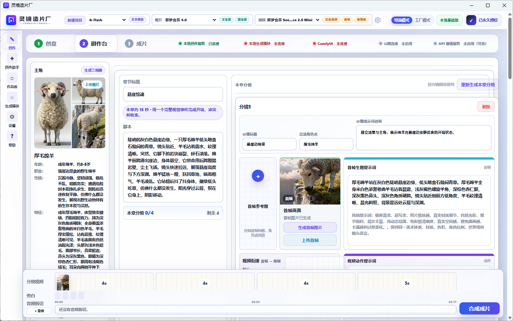
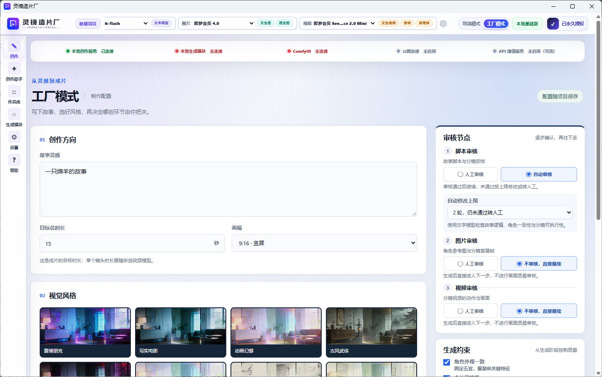
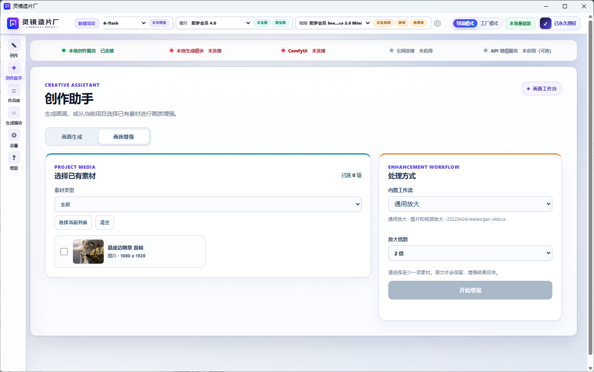
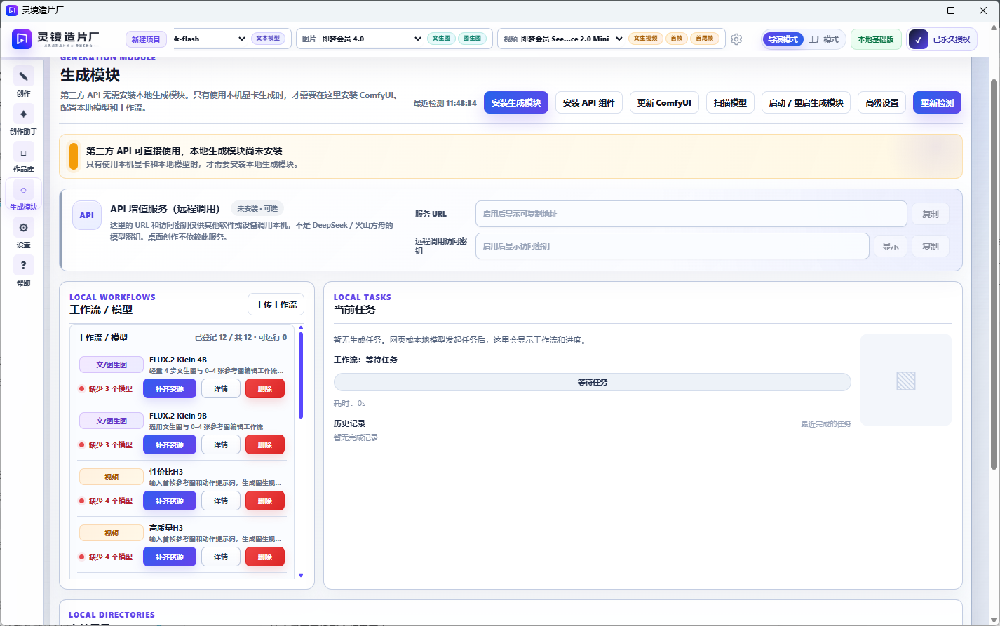
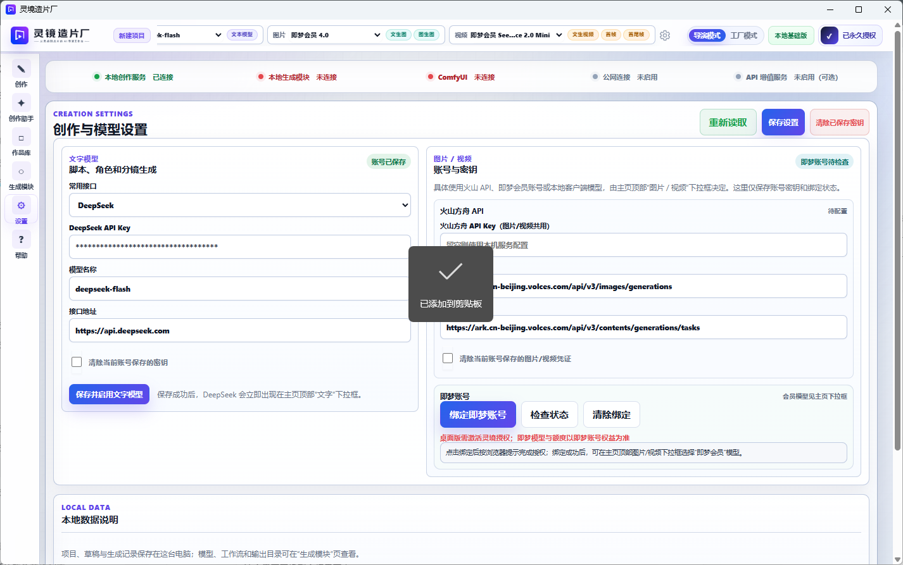

<p align="center"></p>

# 灵境造片厂 · LingJingMovie

**把一个想法，沿着脚本、分镜、素材和镜头，做成一条视频。**

面向个人创作者的 Windows AI 视频工作台。你可以逐步确认创作方向，也可以让工厂模式接续执行；文字、图片、视频模型分别选择，素材和结果留在同一个项目里。


> 当前版本：**0.0.3，早期体验版**。仓库提供产品介绍与发行下载；灵境造片厂为闭源软件，应用内名称和安装目录仍分别为“灵境造片厂”和 `LingJingAPP`。


##**目前所有功能免费获取**
免费领取开发者支持权限，后续不收回。

## 界面预览

**导演模式 · 在同一制作台整理角色、脚本与分镜**

角色参考、章节脚本、首尾帧提示词和镜头素材集中展示，便于逐步查看和调整。



<details>
<summary><strong>工厂模式 · 设置故事、画风和审核节点</strong>（点击展开）</summary>

填写故事灵感、目标时长与画幅，选择视觉风格，并决定哪些步骤自动推进、哪些步骤由你确认。



</details>

<details>
<summary><strong>创作助手 · 选择已有素材，按需增强</strong>（点击展开）</summary>

从当前项目选择素材，指定增强工作流和放大倍数；原文件保留，增强结果另存。



</details>

<details>
<summary><strong>生成模块 · 管理本地环境、工作流和模型</strong>（点击展开）</summary>

查看工作流缺失的模型、补齐资源并跟踪任务。仅使用第三方 API 时，无需先安装完整本地生成环境。



</details>

<details>
<summary><strong>模型设置 · 配置自己的生成服务</strong>（点击展开）</summary>

配置文字模型与图片/视频服务，并按需要绑定即梦账号。截图中的密钥已遮蔽。



</details>

截图来自示例项目；模型选项、授权和服务连接状态以实际配置为准。

## 让精力留在创作上

做 AI 视频，生成一个镜头只是其中一步。脚本拆分、角色参考、分镜整理、素材下载、视频合成，往往需要反复切换工具。

灵境造片厂把这些步骤串成可查看、可确认的制作流程：先看方向是否合适，再继续生成和增强；需要调整时，在项目内修改素材与模型选择。

```text
创意 / 脚本 → 角色与分镜 → 图片素材 → 镜头视频 → 合成与导出
                  ↓                         ↓
              逐步检查、修改            按需放大 / 补帧
```

| 你关心的事 | 对应设计 | 实际用途 |
| --- | --- | --- |
| 想保留每一步的决定权 | 导演模式，分阶段制作与确认 | 适合反复修改脚本、角色和镜头的项目 |
| 想让已确定的方案继续跑 | 工厂模式，支持审核节点和暂停 | 减少相邻制作步骤之间的手动衔接 |
| 已经有 API，或想用自己的显卡 | 自有 API、即梦 CLI、本地 ComfyUI 接入；文字/图片/视频分别选模型 | 按预算、硬件和画面需求选择生成方式 |
| 不想每次都重做增强 | 素材多选、批量放大/补帧、结果缓存 | 重复参数可复用结果；批次中断后继续未完成素材 |
| 环境和模型下载容易断 | 多源测速、断点续传、失败换源、完整性校验 | 降低中断后从头下载的概率 |
| 有工作流，但参数配置不熟 | 规则识别、可选 Qwen 4B 辅助识别、手动修正 | 减少配置工作；无法确认的参数仍由你检查 |

适合短片分镜、动画故事、角色镜头实验，以及已有生成素材的整理与增强。最终画面、角色一致性和生成速度取决于模型、提示词、参考素材及硬件，仍需要创作者判断。

## 两种制作方式，一个素材工作区

**导演模式**：按脚本、角色、分镜、视频、成片逐步推进。需要细调时，先检查当前阶段，再决定是否继续。

**工厂模式**：填写创意和制作要求，按配置的审核节点执行后续步骤。可以暂停后续步骤、调整模型，再继续制作。已经提交到供应商的任务可能仍会完成并计费。

**创作助手**：分别提供图片生成、视频生成和画面增强。图片与视频可直接生成并保存在当前项目；已有素材可多选后执行放大、补帧工作流。缺少增强模型或组件时，处理区显示安装提示，安装后可重新检测。导出页可对最终视频单独执行放大。增强恢复以素材为单位，不从单个视频的中间帧继续。

## 先确认内容，再投入增强

可以先用适合当前预算的模型和分辨率制作镜头，确认内容后，再增强选中的素材或最终视频。

- 图片/视频 AI 放大与视频补帧。
- 批量处理现有资源，复用相同素材与参数的已有结果。
- 主程序与 ComfyUI 算力环境分开提供，只使用 API 时无需下载完整本地生成环境。
- 内置与 LingJingAPI 同步的工作流预设，包括高质量 H3、性价比 H3 等；实际可用性以依赖检查为准。
- 可导入其他工作流、下载或关联本地模型。自定义节点、非标准结构或来源不明的模型可能需要手动配置。

## 0.0.3 更新

- 创作助手增加独立的视频生成页，支持按模型能力选择首帧与尾帧，生成结果归入当前项目。
- 环境修复的文字、图片、视频模型都使用行内复选框，明确展示本次修复范围。
- 画面增强检查实际模型和组件状态，缺失时遮罩处理区并提示安装、重新检测。
- 生成模块精简操作，使用“重启模块”重启本地后台服务与 ComfyUI。
- 未授权时过滤即梦会员和本地模型；文字、火山 API 分别保存，清除密钥同时退出即梦 CLI。
- 文字接口可检测实际模型列表，支持下拉选择和手动填写。
- 基础环境和本地生成环境分别显示状态，驱动不符合要求时提示升级，修复过程不强制安装驱动。

## 下载与开始

1. 打开 [**Releases**](https://github.com/Yaro-lu/LingJingMovie/releases)，下载 `LingJingAPP-Setup-0.0.3-Protected-win-x64.exe`。
2. 安装并启动“灵境造片厂”，在设置中填写自己的 API 配置；也可按需激活支持者功能。
3. 新建项目，从一个短镜头或简单故事开始，选择导演模式或工厂模式。
4. 需要本地生成时，在生成模块点击“一键修复环境”，确认显存方案；文字模型默认勾选，文字、图片、视频模型都可分别选择。全部取消勾选时只修复环境，也可导入离线环境包。
5. 预览素材与视频，确认后合成导出；需要更高输出规格时再执行增强。

| 下载项 | 大小 | 什么时候需要 |
| --- | --- | --- |
| Windows 主安装包 | 约 257 MiB | 所有用户 |
| 安装包 SHA256 | 小文件 | 校验下载是否完整 |
| 独立 ComfyUI 环境包 | 约 1.98 GiB | 本地模型生成；也可在应用内在线安装 |
| 环境包 SHA256 | 小文件 | 校验离线环境包 |

主安装包为 0.0.3；独立环境包版本仍为 2.0.0，保留在 0.0.1 的发布资产中。主安装包、独立环境包与各自的校验文件统一在 [**Releases**](https://github.com/Yaro-lu/LingJingMovie/releases) 中获取。环境包与 LingJingAPI 使用相同版本，ComfyUI 保持原始形式，未做代码混淆；生成模型权重按需另行下载。使用应用内的环境包导入入口安装，不要把环境包当成主程序安装器。

**系统要求**：Windows 10/11 x64。仅调用第三方 API 不要求本机具备 NVIDIA 显卡。当前独立 CUDA 13 环境面向 NVIDIA RTX 20 系及后续显卡，要求匹配的驱动（580 或以上）和至少 8 GB 显存；这不代表所有工作流都能在 8 GB 上运行，请以工作流的具体要求为准。

## 免费能力与支持者功能

| 能力 | 使用方式 |
| --- | --- |
| 自有第三方 API 接入 | 应用侧免费；模型供应商费用另计 |
| 普通项目编辑、素材查看、普通合成导出 | 免费 |
| 即梦 CLI、本地模型、AI 放大/补帧 | 单设备永久支持者授权 |

支持价格以付款页面为准。从应用右上角“支持者授权”进入，登记机器码后再付款，系统会关联订单与授权。**支持者授权不包含第三方模型额度或即梦会员权益**，供应商账号权限与费用仍由对应平台决定。

已激活授权在正常启动时本地验证，无需每次联网验证。购买、恢复购买和在线服务本身需要联网。同一机器码重装软件可恢复原授权；重装系统或更换硬件可能改变机器码，当前不提供自助换绑。

## 常见问题

**没有高性能显卡，能用吗？**  
可以使用自己配置的第三方 API。需要本地推理或增强时，再检查相应功能的硬件要求。

**能完全离线使用吗？**  
已安装环境、节点和模型且已激活相应权限的本地流程，可使用本机资源。云 API、即梦、在线下载与购买恢复需要联网；部分第三方工作流也可能依赖网络。

**任意工作流都能一键运行吗？**  
不能保证。自动识别提供配置辅助，仍须满足模型、节点和参数要求。来源不明确或存在多个候选的模型，需要手动确认或关联已有文件；不会用文字模型编造下载地址。

**项目和素材保存在哪里？**  
保存在本机工作区。调用云端模型时，相关提示词和参考素材会发送给你选择的服务商。反馈问题时请勿上传 API Key、完整机器码、SN 或私人素材。

**下载了“Source code.zip”，为什么没有安装程序？**  
GitHub 自动生成的 Source code 压缩包只包含本仓库的介绍与发行信息。请从 Releases 下载上表中的 `.exe` 安装包。

**LingJingAPI 同时运行怎么办？**  
两个程序当前共用本地服务端口。APP 检测到 LingJingAPI 正在运行时会提示退出；请从 API 的系统托盘选择“退出”，再启动 APP。关闭窗口可能只是最小化。

## 当前状态与反馈

0.0.3 已完成定向自动检查与保护产物启动检查；真实 GPU 生成、不同显卡/驱动组合及全新 Windows 安装仍需进一步实机验证。安装包尚未配置 Windows Authenticode 数字签名，请从本仓库下载并核对 SHA256；不要关闭系统防护。

遇到问题，请通过 [Issues](https://github.com/Yaro-lu/LingJingMovie/issues) 提供版本、Windows 版本、显卡/显存、操作步骤和已脱敏的错误信息。付款、授权或隐私问题请联系 **[lol.lu@qq.com](mailto:lol.lu@qq.com)**。

## 版权与第三方组件

Copyright © 2026 Yaro-lu. 灵境造片厂自有代码保留所有权利；公开下载不代表授予项目级开源许可。第三方软件、模型和生成服务分别受各自的许可证和使用条款约束，相关权利不受本声明限制。

感谢 ComfyUI、Python、PyTorch、Node.js、PGlite、FFmpeg、RIFE、Real-ESRGAN、ncnn、7-Zip 等项目。完整许可证随发行文件保留。视频内容能否商用取决于所用模型、素材和服务条款，支持者授权本身不替代这些授权。
